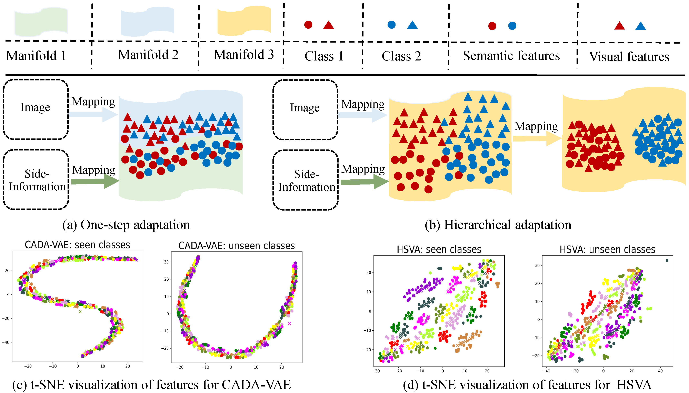
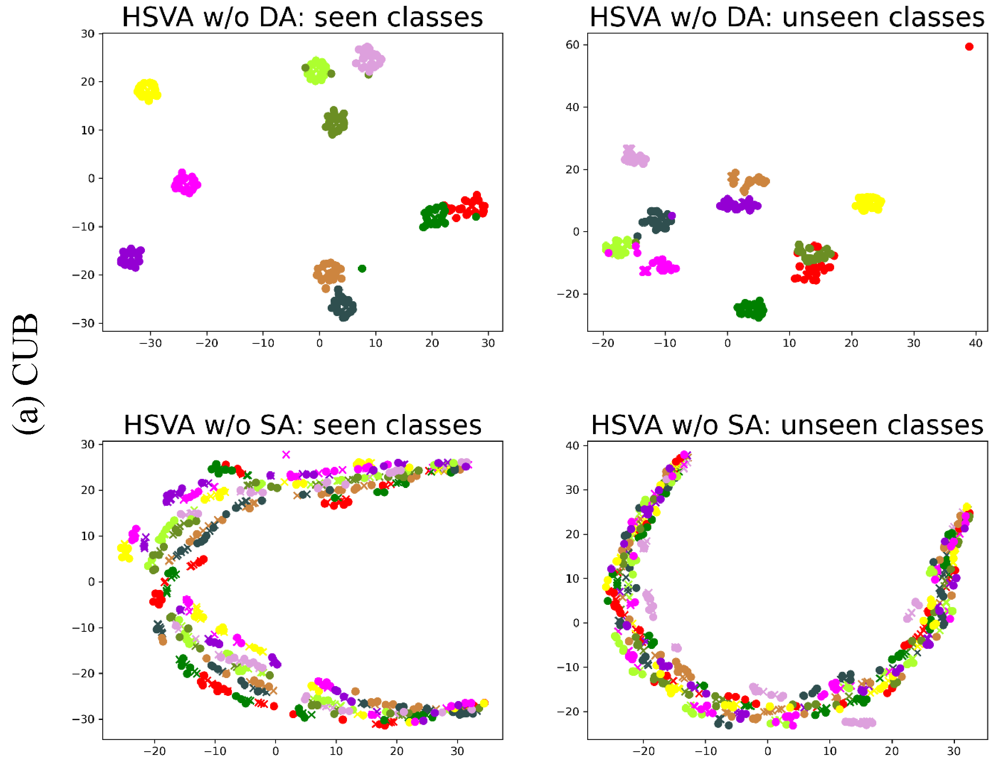
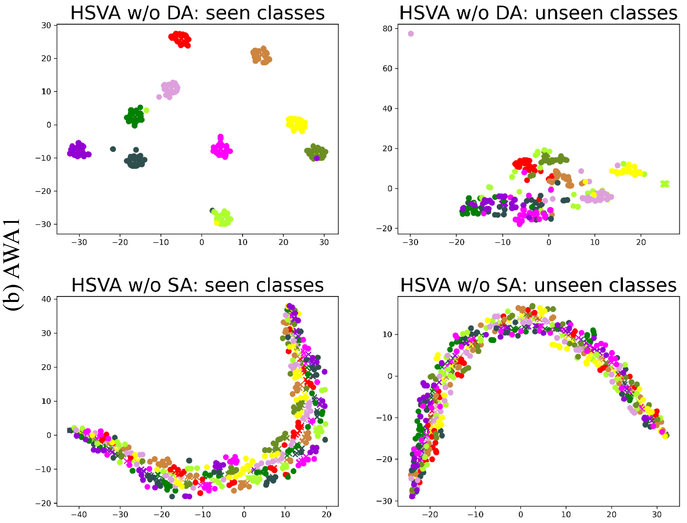

# HSVA-NeurIPS-21
This is the implementation of “**HSVA: Hierarchical Semantic-Visual Adaptation for Zero-Shot Learning**” in Pytorch. The paper is procceding in NeurIPS 2021.<br/>

<center class="half"></center>


<!--## t-SNE Visualization for HSVA w/o SA or DA (Used for Rebuttal)
<b>To view these qualitative results clearly, please download these original figures from [Here](https://github.com/anonymou-ssubmition/HSVA-NeurIPS-21/tree/main/figs).</b>
<center class="half"></center>
<center class="half"></center>-->

## Preparation
1. Datasets can be downloaded [Here](https://datasets.d2.mpi-inf.mpg.de/xian/xlsa17.zip).  Put it in the `data` dir.
2. Download our pretrained models from google drive [Here](https://drive.google.com/drive/folders/1h_hX114jLEa2ah5k1_Yp1nPoclinuRCw?usp=sharing), including CUB, SUN, AWA1 and AWA2 models. Put it in the `result` dir. Note that we just provide one pre-trained model for every dataset.

## Training
To Train the HSVA in the GZSL or CZSL setting, please run the commands in the following:
```
CUDA_VISIBLE_DEVICES="2" python single_experiment.py --dataset CUB --latent_size 64 --generalized True
CUDA_VISIBLE_DEVICES="2" python single_experiment.py --dataset SUN --latent_size 128 --generalized True
CUDA_VISIBLE_DEVICES="2" python single_experiment.py --dataset AWA1 --latent_size 64 --generalized True
CUDA_VISIBLE_DEVICES="2" python single_experiment.py --dataset AWA2 --latent_size 64 --generalized True
```
`--gdataset` test dataset, i.e., CUB, SUN, AWA1, and AWA2.

`--generalized` test for GZSL (**True**) or CZSL (**False**).

## Testing
To test the results for GZSL or CZSL, please run the commands in the following:
```
CUDA_VISIBLE_DEVICES="2" python test.py --dataset CUB --latent_size 64 --generalized True
CUDA_VISIBLE_DEVICES="2" python test.py --dataset SUN --latent_size 128 --generalized True
CUDA_VISIBLE_DEVICES="2" python test.py --dataset AWA1 --latent_size 64 --generalized True
CUDA_VISIBLE_DEVICES="2" python test.py --dataset AWA2 --latent_size 64 --generalized True
```
`--gdataset` test dataset, i.e., CUB, SUN, AWA1, and AWA2.

`--generalized` test for GZSL (**True**) or CZSL (**False**).
 
## Results
Results of our released model using various evaluation protocols on four datasets, both in conventional ZSL (CZSL) and generalized ZSL (GZSL) setting.

|Datasets | U | S| H| acc |
| ----- | ----- | ----- | ----- | ----- |
| AWA1 | 61.1 |	75.2 |	67.4 | 70.6 |
| AWA2 | 57.8	| 79.3	| 66.9 |  --  |
| CUB  | 51.9	| 59.5 |	55.5 | 62.8 |
| SUN  | 48.6	| 39.0	| 43.3 | 63.8 |

## Citation
If this work is helpful for you, please cite our paper.

```
@inproceedings{Chen2021HSVA,  
  title={HSVA: Hierarchical Semantic-Visual Adaptation for Zero-Shot Learning},    
  author={Chen, Shiming and Xie, Guo-Sen and Peng, Qinmu and Liu, Yang and Sun, Baigui and Li, Hao and You, Xinge and Shao,  Ling},    
  booktitle={35th Conference on Neural Information Processing Systems (NeurIPS)}, 
  year={2021}    
}
```
## Ackowledgement
We thank the following repos providing helpful components in our work.
1. [CADA-VAE](https://github.com/edgarschnfld/CADA-VAE-PyTorch)
2. [MCD-DA](https://github.com/mil-tokyo/MCD_DA)
