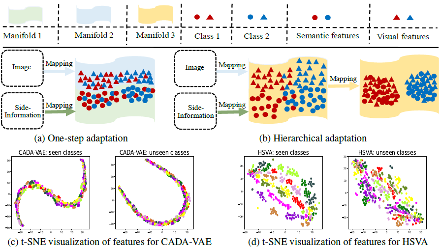
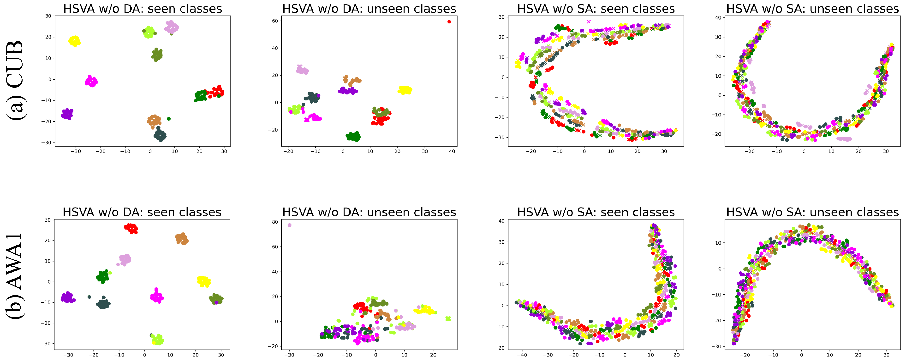

# HSVA-NeurIPS-21
This is the implementation of “**HSVA: Hierarchical Semantic-Visual Adaptation for Zero-Shot Learning**” in Pytorch. The work is anonymously submitted to NeurIPS'21.
Note that this repository includes the trained model and test scripts, which is used for testing and checking our results repoted in our paper. <b style='color:red'>Once our paper is accepted, we will release all codes of this work</b>.<br/>

<center class="half"></center>


## <font color=#008000> t-SNE Visualization for HSVA w/o SA or DA (Used for Rebuttal)</font>
<center class="half"></center>

## Preparation
1. Datasets can be downloaded [Here](https://datasets.d2.mpi-inf.mpg.de/xian/xlsa17.zip).  Put it in the `data` dir.
2. Download our pretrained models from google drive [Here](https://drive.google.com/drive/folders/1h_hX114jLEa2ah5k1_Yp1nPoclinuRCw?usp=sharing), including CUB, SUN, AWA1 and AWA2 models. Put it in the `result` dir. Note that we just provide one pre-trained model for every dataset.

## Test
To test the results for GZSL or CZSL, please run the commands in the following:
```
CUDA_VISIBLE_DEVICES="2" python test.py --dataset CUB --latent_size 64 --generalized True
CUDA_VISIBLE_DEVICES="2" python test.py --dataset SUN --latent_size 128 --generalized True
CUDA_VISIBLE_DEVICES="2" python test.py --dataset AWA1 --latent_size 64 --generalized True
CUDA_VISIBLE_DEVICES="2" python test.py --dataset AWA2 --latent_size 64 --generalized True
```
`--gdataset` test dataset, i.e., CUB, SUN, AWA1, and AWA2.

`--generalized` test for GZSL (**True**) or CZSL (**False**).
 
## Results
Results of our released model using various evaluation protocols on four datasets, both in conventional ZSL (CZSL) and generalized ZSL (GZSL) setting.

|Datasets | U | S| H| acc |
| ----- | ----- | ----- | ----- | ----- |
| AWA1 | 61.1 |	75.2 |	67.4 | 70.6 |
| AWA2 | 57.8	| 79.3	| 66.9 |  --  |
| CUB  | 51.9	| 59.5 |	55.5 | 62.8 |
| SUN  | 48.6	| 39.0	| 43.3 | 63.8 |

